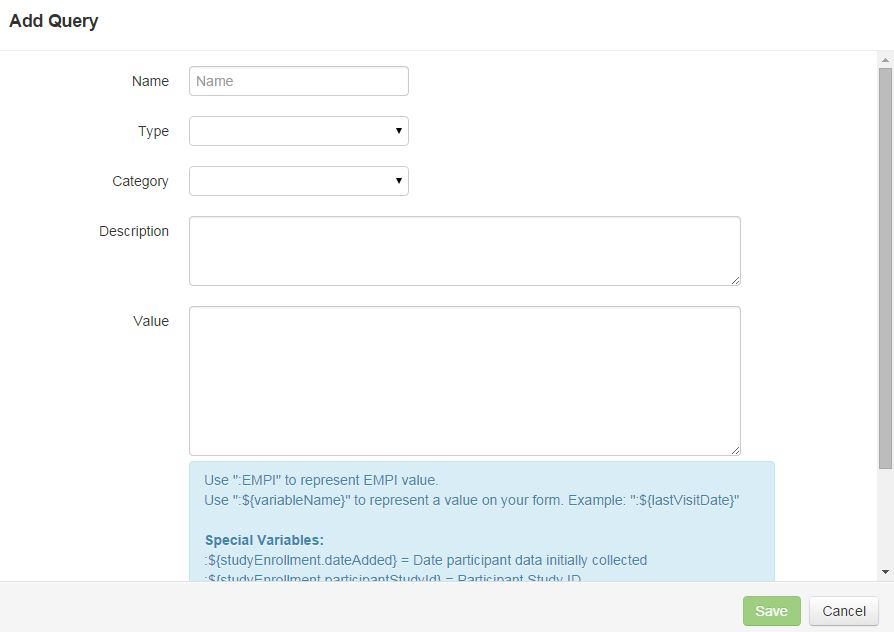

# Query Library
A Query Library is a list of all SQL queries saved in ResearchDoc that can be used to pre-screen for a study or populate data at the participant level.

####How to Add a Query
1. Click **Add**.
2. Enter name of query.
3. Select type of query from dropdown list.
4. Select the category of the query.
5. Enter a description of the query.
6. Paste the value in the "Value" box.
7. To run an evaluation test of the query, click **Test Query**.
8. Click **Save**.

