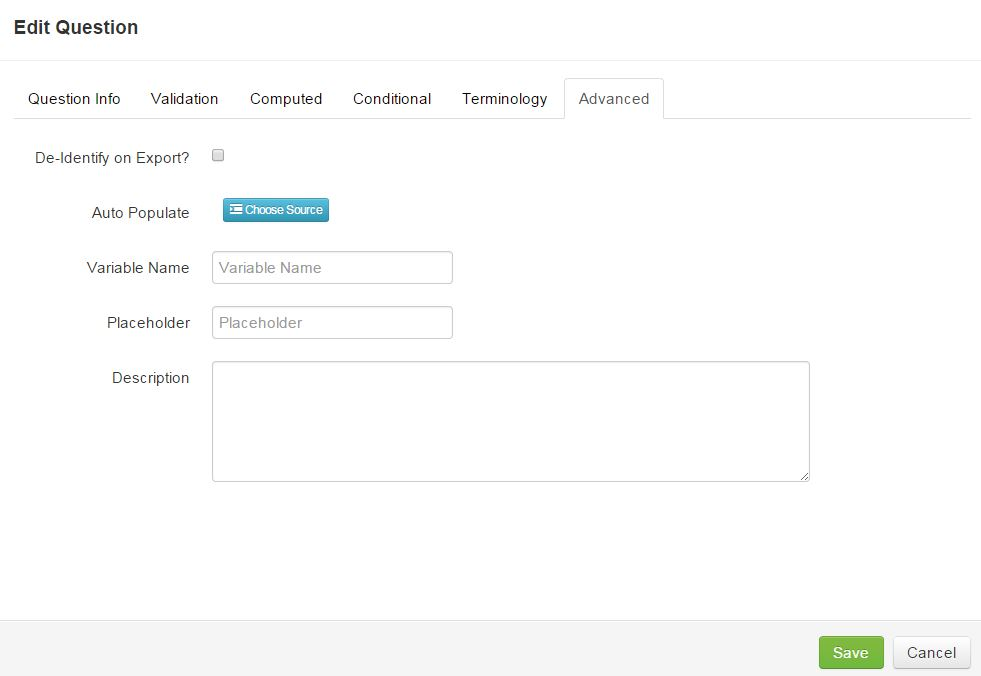

# Advanced Options

The Advanced Options tab allows for more advanced features on a question in ResearchDoc.

####De-Identifying Data
To de-identify a question on export, check the "De-Identify on Export?" checkbox.

####Auto Populate
To auto populate data, write an SQL query or work with the EDW team to get an SQL query written. This query will pull data from the EDW based on a participant's EMPI. Please send the HWCIR team the EDW query so it can be added to the query library. Once added to the query library, the query can be selected from the list of available queries.

####Variable Name
A variable name is required for questions that are used in calculations or conditional logic.
Tips for creating a variable name: Do not use periods when creating a variable name, variable names are case sensitive, and spaces are okay when writing the syntax.

####Placeholder
A placeholder is only used for the iPad application. Instead of the prompt "Tap to Enter" a different prompt can be created for string and number answer types.

####Description
A description is used as a hover over feature to include more helpful data about the question. A description can also be used when creating a signature pad. Any data added in the description field can be used as descriptive text or a phrase pulled directly from a form that may be signed.

