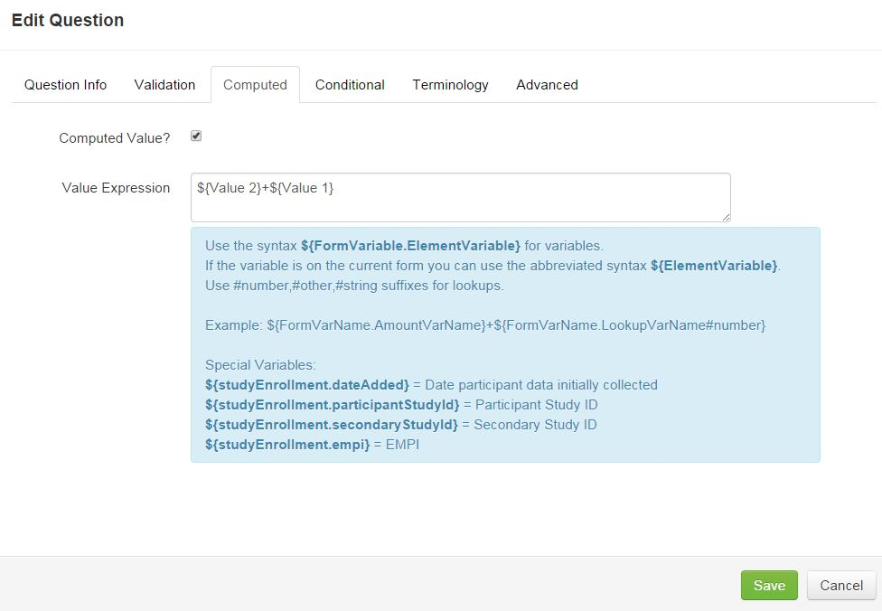

# Computed Fields

Computed Fields can be added to a question to calculate a value from one or more fields.

####How to Create a Computed Field

1. Click the **Computed** tab when adding a question.
2. Select the **Computed Value?** check box.
3. Enter syntax for computed value. Remember the field that is supplying the answer is where the syntax needs to be written. Any other fields used to create the computed field need to have a variable name created included in the syntax written (for example, for a Value 1 + Value 2=? computation, use the syntax **${Value1}+${Value2}**).

