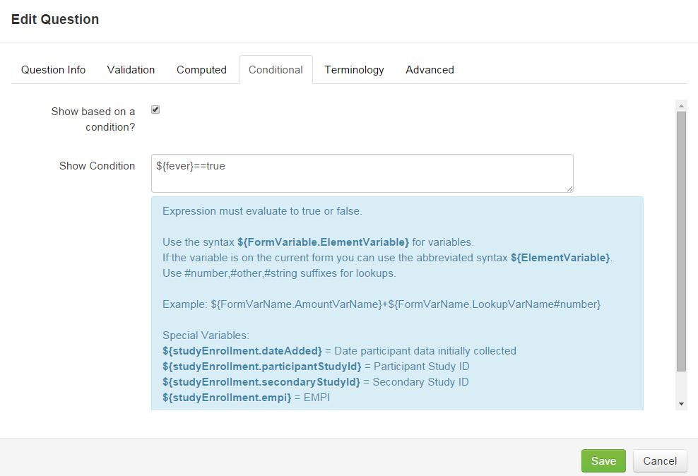

# Conditional Logic

Conditional Logic can be created to show or hide a value based on the data collected in questions previously answered.

####How to Create Conditional Logic

1. When adding a question, click the **Conditional** tab.
2. Select the **Show based on a condition?** check box.
3. Enter syntax for conditional logic. Remember the field that will be shown/hidden is where the syntax needs to be written. Any other fields used to trigger the conditional logic need to have a variable name created and included in the syntax written.
4. If you want to reference a variable in a different form or sub form, add that variable name in your syntax (for example, **${formvariablename.questionvariablename}**).
5. Evaluate expressions to either true or false (for example, to show if the sum is greater than 20, use the syntax **${Sum's}>20**).

