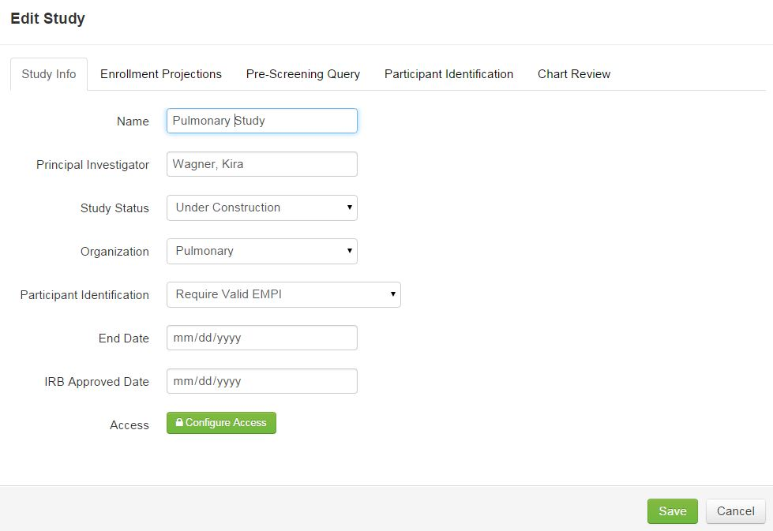
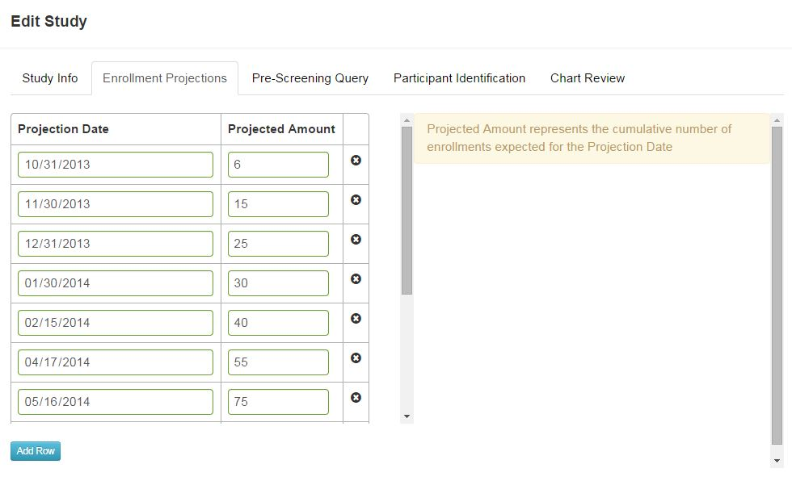
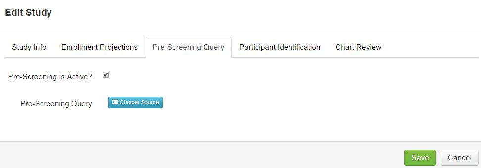
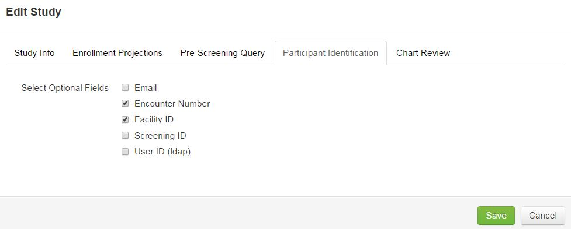
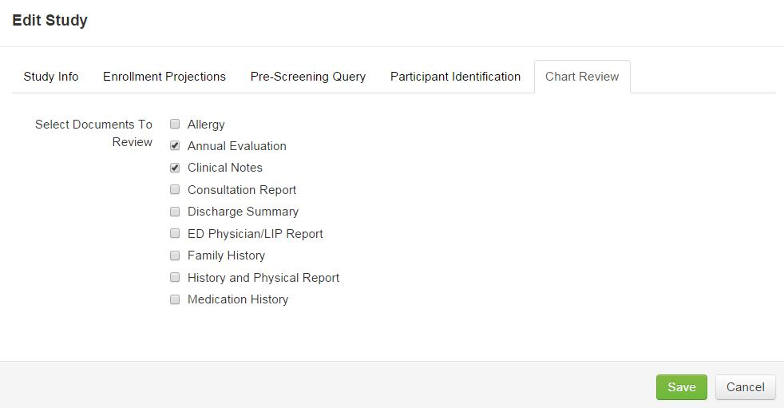

# Define Study

Define Study is where studies or projects can be created and edited.

####How to Create a Study or Project

1. Click **Author Studies**.
2. Select **Define Studies**.
3. Click **Add**.

####Study Info Tab
1. Enter information for study.
2. Enter name of study.
3. Start typing name of Principal Investigator and select it from the drop down list.
4. Select the Study Status. Under Construction is used to create a project and run test data through it to make sure it is designed properly. Active will allow actual patient data to be collected. (NOTE: Test data collected during Under Construction will be hidden when study is set to Active.) Closed is used when the study is completed and no more data will be entered for the study.
5. From the drop down menu, select the Organization.
6. Next to Participant Identification, select Require Valid EMPI or Require Study ID (EMPI Not Required).
7. Enter End Date if applicable.
8. Enter IRB Approved Date if applicable.

####Enrollment Projections Tab
Enrollment Projections will be shown on the Dashboard and will show three line graphs, including participant enrollment projections created in this screen, actual enrollments, and other statuses.
1. Click **Add Row**. Adding a row will show the current date and add 10 participants to the projected amount.
3. Change the date and projected amount as needed. An entire row can also be deleted.

####Pre-Screening Tab
A pre-screening query can be created to pre-screen for a list of possible candidates for a study.
1. Click **Author Studies** > **Define Studies**.
2. Select study.
3. Click **Properties**.
4. Click the **Pre-Screening Query** tab.
5. Check the "Pre-Screening Is Active?" checkbox.
6. Next to Pre-Screening Query, click **Choose Source**.
7. Select source from list and click **Save**.
8. Click **Save**.

####Participant Identification
Additional fields can be added to the participant enrollment screen.
1. Check additional fields to be included in the participant enrollment screen, including: Email, Encounter Number, Facility ID, Screening ID, User ID (LDAP).

####Chart Review
Chart reviews can be populated based on a participant's EMPI and data from that chart review can be copied into the participants record.
1. Check all chart reviews required for a study. Options currently include: Allergy, Annual Evaluation, Clinical Notes, Consultation Report, Discharge Summary, ED Physician/LIP Report, Family History, History and Physical Report, and Medication History.

