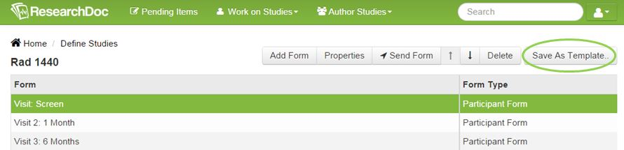
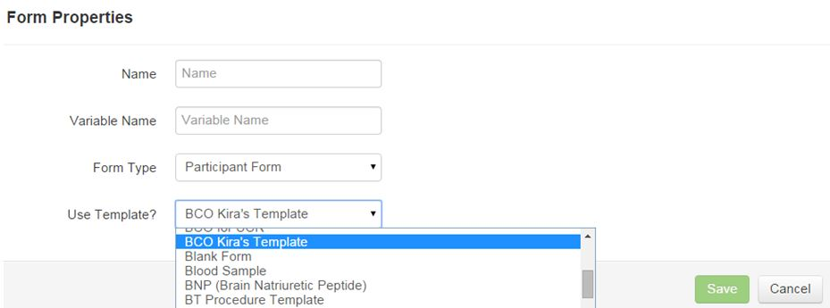

# Form Templates

A Form Template is a place where all templates can be found.

####How to Create a Template
1. Select a form or a sub form and click **Save As Template**.
2. Name the template.
3. Select an organization.
4. Click **Save**.

####How to Add a Template to a Study
1. When defining a study, click **Add Form**.
2. Enter name of form.
3. Enter variable name if applicable.
4. Select form type.
5. Next "Use Template" select a template.
6. Click **Save**.

