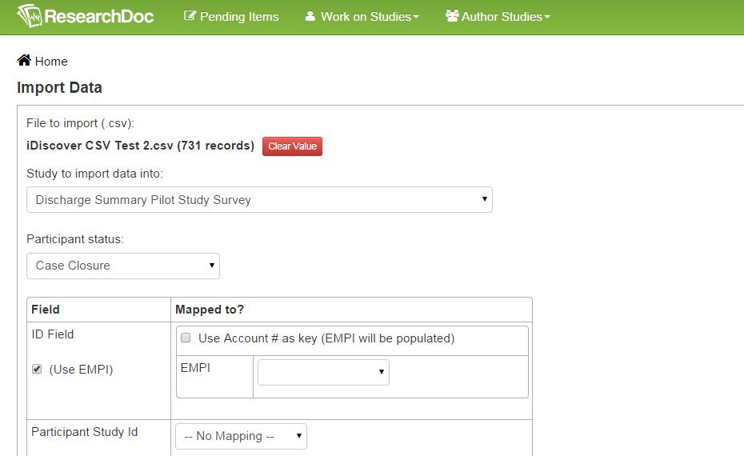

# Import Data

Data saved in a CSV file in Excel can be imported into ResearchDoc. This can be a great way to save time so data does not need to be entered twice.

####How to Import Data
1. Click **Author Studies** > **Import Data**.
2. Click **Choose File** and select the CSV file.
3. Select study from the drop down list.
4. Next to Participant Status, select what status every participant should have.
The top section is for the participant mapping. Next to each field select the correct participant information from the CSV file.
6. If more fields need to be added, click **Add Mapping Column**.
7. Enter a name for the mapping created and click **Save Mapping**. The bottom section is for data mapping. On the left are the files pulled in from the CSV file.

8. Click **Choose Item** and select the question in ResearchDoc where the data needs to be mapped.
9. Enter Mapped Value information, Conditional Logic information and Date Format information where applicable.
10. When all fields have been mapped, click **Import Data**. We suggest importing only one or two test participants at first to make sure all data is imported properly then import the entire list of participants once everything has been mapped correctly.

####Extra Information on Importing Data
1. There may be a few questions in the .CSV file that will not need to be mapped into the form section when importing data. These questions can be deleted by clicking the "X" next to the question.
2. To show a date with a format of 12/24/2014, type MM/dd/yyyy in the Date Format section (case sensitive).
3. The eraser icon will delete any mapping that has been entered for a question.
4. Conditions can be added when mapping data in the condition field. In the Condition field, select a question and enter syntax to create the conditional logic based on the questions selected.
5. Data can be imported into a lookup answer type but can only be used if the lookup has a number value on each lookup option. For example, if the lookup options are Apple, Pear, Mango, each lookup option needs a number value to pull in. Ex: Apple = 1, Pear =2, Mango= 3. Also, the .CSV file needs to be converted to the number system. If Apple needs to be imported, the value in Excel needs to be 1 to be imported properly. On the Import Data screen, in the Mapped Value section the word **number** needs to be written (No quotes, no caps, no other characters) If done correctly "Apple" will appear in the lookup.

