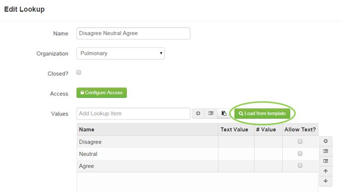

# Lookup Templates
A Lookup Template is a way to create a lookup (multiple choice question) and save it as a template to re-use it and save time when creating many questions with the same lookup.

####How to Create a Lookup Template
1. Click **Author Studies** > **Lookup Templates**.
3. Click **Add**.
4. Enter Lookup name and click save. Create a name that is made of the lookup options to make for easier selection in the future. For example, "Lookup for Test Study" is too generic of a name to be helpful. However, "Agree, Disagree, Neutral" is a very clear and specific lookup name.
5. Find lookup that was created and double-click to open and enter the lookup information.

####How to Add a Lookup Template to a Question
1. When adding a question, select Lookup next to the answer type.
2. In the lookup matrix, click **Load from Template**.
3. Select the lookup template needed.
4. Click **Save**.
5. Save the question.

