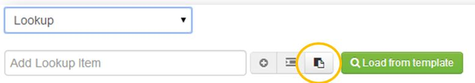
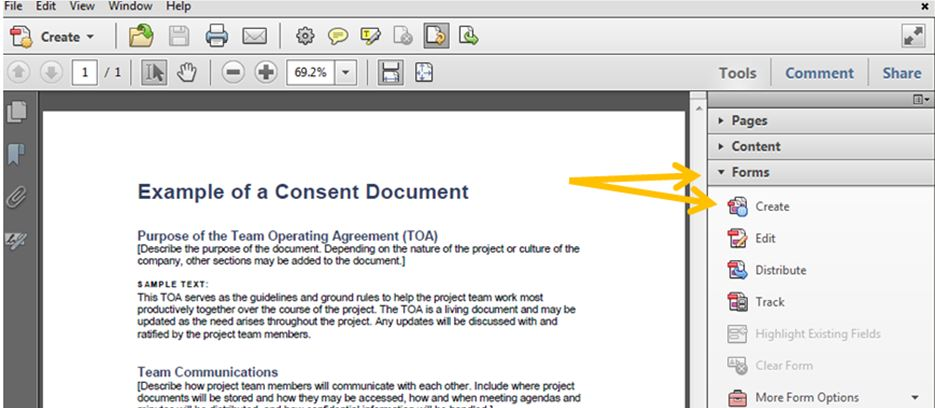
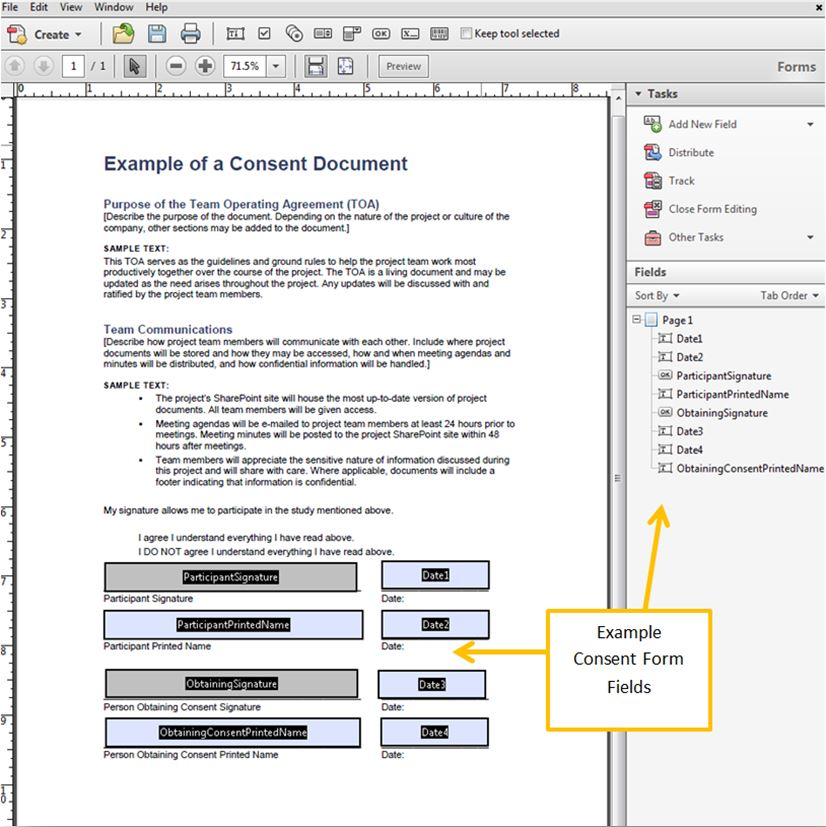
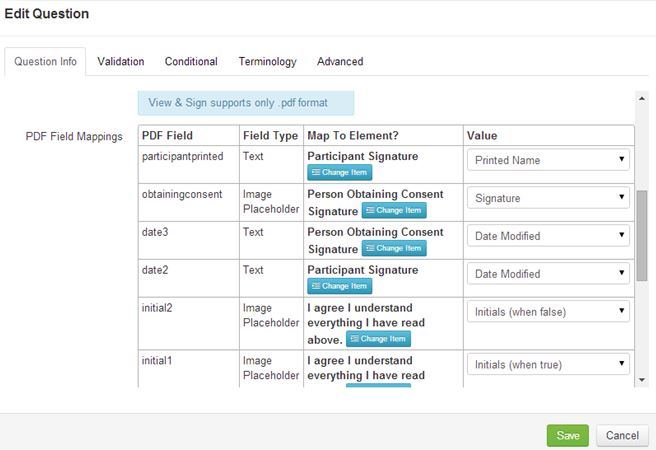

# Answer Types

When defining a study, there are many ways to answer a question. Below is information on each of the available answer types in ResearchDoc.

####Attach File
Attach File allows the user to attach a file when entering data. On the desktop version, any file can be uploaded. On the iPad, a picture can be taken and uploaded, a photo from the photo album can be uploaded, or a video or audio recording can be uploaded. Supported file types include, audio, video, PDFs and images

####Checkbox
A Checkbox can be checked or unchecked.

####Date
A Date will allow the user to select a date from a calendar widget or a date can be typed using the keyboard.

####Date and Time
Date and Time allows user to enter a date from calendar widget or typed, and enter a time. The time format (AM/PM or 24 hour) is relative to the computer that is used. If the native version of the time needs to be changed for data entry purposes, please see the FAQs section to learn how to change it on a Windows computer.

####Description
A Description is informative text. No data can be entered on this answer type.

####List of Items
List of Items allows a user to create a group of questions that may be added one to many times as needed for data entry purposes.

####Lookup
A Lookup is a multiple choice question where only one option can be selected. A Lookup also allows text to be entered next to a question.

#####How to Create a Lookup
1. Select Lookup from the answer type drop down list and the lookup matrix will appear.
2. Next to "Lookup Items" enter the names of each lookup and hit Enter on the keyboard or click the add **+** button.
3. Enter data in the "Text Value", or # Value. Text values can be added if additional coding needs to be added to a lookup value. A number value can be used to do calculations from various lookup questions. NOTE: calculations cannot be used on the same lookup question. We recommend a number value used when importing data from Excel into a lookup value, a text value can be used, but it is not recommended.
4. Check the "Allow Text?" checkbox if the lookup value can allow a text field.
5. Use the right and left adjust buttons to create parent and child relationships.
6. Use the up and down arrow buttons to re-order options in a lookup question.

#####How to Create a Bulk Upload Lookup
If creating a lookup with a large number of options you can upload them from an Excel file.
1. Click on the bulk upload button.
2. Select what order the fields are listed in Excel. Ex: Text, Caption, Number and so on.
3. Caption, is the name of the question.
4. Text is the text value of the lookup.
5. Number is the number value of the lookup.
6. Copy the fields from Excel and paste them in the box in ResearchDoc. Select if the Excel file is delimited by a tab or comma.
7. Click **Save** then the lookup options will be pulled into ResearchDoc in the correct fields or date answer type.

####Multi-Line String
A Multi-Line String allows for a large amount of alphanumeric text to be entered. A pop up box will appear where data can be entered.

####Multi-Value Lookup
Like a Lookup, a Multi-Value Lookup will create a multiple choice question. However, a Multi-Value Lookup allows more than one option to be selected. Free text is also allowed on a Muti-Value Lookup. To create a lookup, see the **How to create a Lookup** section.

####Number
A Number allows a user to enter numeric only data. Units can also be added to a number answer type. Add units by following the steps on the lookup answer type.

####Rating (Stars)
Rating (Stars) allows a person entering data to select from 1 to 10 stars. When setting up the question, select the maximum number of stars. The minimum number of stars is 5.

####Signature Pad
Signature Pad allows a user to electronically create a signature using the mouse on the desktop or finger on the iPad. Signatures can be mapped to a PDF using the "View and Sign" answer type.

####Silder
A Slider is used to select a number by sliding the Slider left and right. Sliding to the left will reduce the number, slide to the right, will increase the number. When creating a Slider, a minimum and maximum value can be set.

####String
A String answer type allows a user to enter alphanumeric data. Only 26 characters will be shown at one time.

####Sub Form
A Sub Form is a group of questions which can be created to group similar questions together. By default a sub form is collapsed, but can be expanded by clicking on the sub form folder. A sub form can be "Marked as Complete." Marking a sub form as complete will lock in the data that has been collected. and can be edited again by clicking "Re-open and Modify."

#####How to Create a Sub Form
1. Next to Answer Type, select Sub Form.
2. Select a template to load from if applicable, if not click **Save**.
3. Double click on the sub form that was just created to create new questions under that sub form.
4. When the sub form has been created, click the back arrow in Chrome to get back to the form where remaining questions that do not belong in the sub form may be created.

####View and Agree
View and Agree will allow a user to view a document and select agree or disagree next to the document. When creating a view and agree answer type, upload the document or reference a URL.

####View and Sign
A View and Sign answer type will allow signatures, printed names, dates, strings, checkboxes, yes/no questions and initials to be mapped to a PDF. When creating a View and Sign answer type, a PDF needs to have fields mapped in Adobe Acrobat and then mapped into the view and sign answer type. Once the PDF is uploaded, each field needs to be mapped to a question previously created in ResearchDoc and the mapped value needs to be selected from the drop down box based on the type of question that is being answered.

#####Creating Fields in Adobe Acrobat
1. Contact Front Line Support and work with your manager to see if you can get Adobe Acrobat pushed to your computer.
2. Click **Tools** > **Forms** > **Edit**.
3. Under Add or Edit Form Fields message, select No.
3. Under Tasks section, click **Add New Field**.
4. To set up Signature, click **Add New Field** > **Button**. Click on the form where the signature belongs. On the button properties popup under the General tab, create a name. Adjust font size and set background color to No Color.
5. To set up Printed name, click **Add New Field** > **Text Field**. Click on the form where the printed name belongs. On the properties pop-up under the General tab, create a name. Adjust font size if needed.
6. To set up Checkbox, click **Checkbox**. Click on the form where the checkboxes belong. On the properties popup under the General tab, create a name. Adjust font size if needed.
7. To set up Text, click **Add New Field** > **Text Field**. Click on the form where the text belongs. On the properties popup under the General tab, create a name. Adjust font size if needed.

####ResearchDoc Consent Form Steps
1.	Add all questions required for consent in ResearchDoc (for example, participant’s signatures, checkboxes, etc.).
2.	Add View and Sign answer type and upload the consent form and map each PDF field with the question created in ResearchDoc, then select each value required that will be pulled into the PDF.

IMPORTANT: If you are creating a signature and need the printed name and date signed from that signature, you only need to create the signature pad answer type in ResearchDoc. The printed name and date signed information can be pulled directly from the signature pad answer type. You do not need to create additional questions for printed name and signature.

Question types with Values to select in ResearchDoc:
1. Date: Date Modified
2. String of text:  Form Value
3. Signature: Signature
4. Printed Name: Printed Name
5. Checkbox: Select “When True” or “When False”

####View File
View File allows an attached file to be viewed during data entry. Supported files include, audio, video, PDFs and images.

####Yes/No
A Yes/No answer type simply allows a user to select yes or no when entering data. The only way to clear a yes/no value is to clear the value in the comments section.

