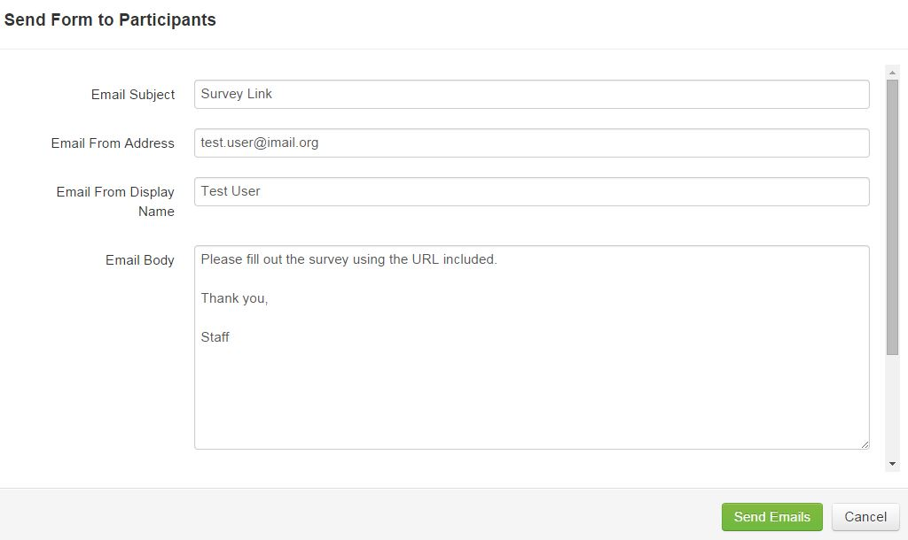
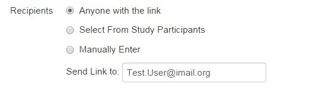
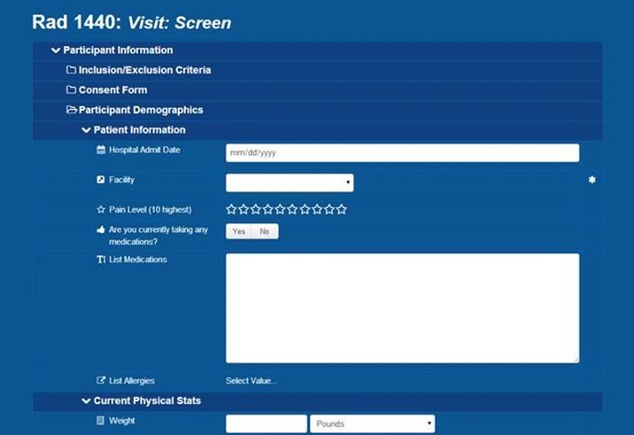

# Send Form

Sending a form is used to do internal surveys for staff members. Forms currently cannot be sent outside of Intermountain Healthcare's corporate firewall. Users will receive an email with a URL that will direct them to a simplified version of the form created in ResearchDoc, which they will log into using their LDAP username and password.

####How to Send a Form
1. When defining a form, click **Send Form**.
2. Enter email subject.
3. Enter email address the email will be sent from.
4. Enter display name of the email address.
5. Enter body of email text.

6. Select the recipient of the email. **Anyone with a Link** will create one URL that can be hosted on an Intermountain Healthcare internal website and direct anyone to fill out the form. **Select Form Study Participants** will allow user to select from a list of participants that have previously been added to a study. **Manually Enter** will allow the user to manually type in email addresses to send to staff members.
10. When emails are ready to be sent, click **Send Emails**.
11. When a user clicks "Submit" the participant will be "submitted for approval" when the "Submit" button is clicked, the form will be "Pending Approval". Data will be saved even if "Submit is not clicked"

