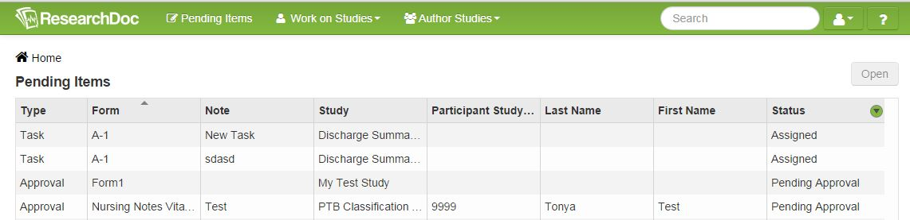
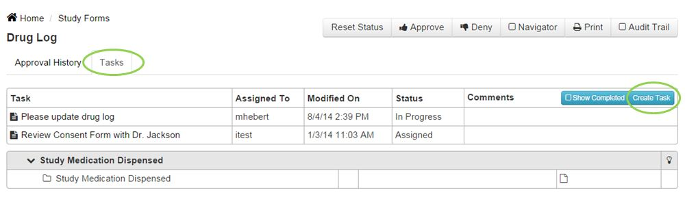
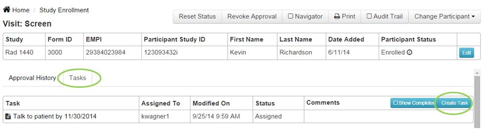
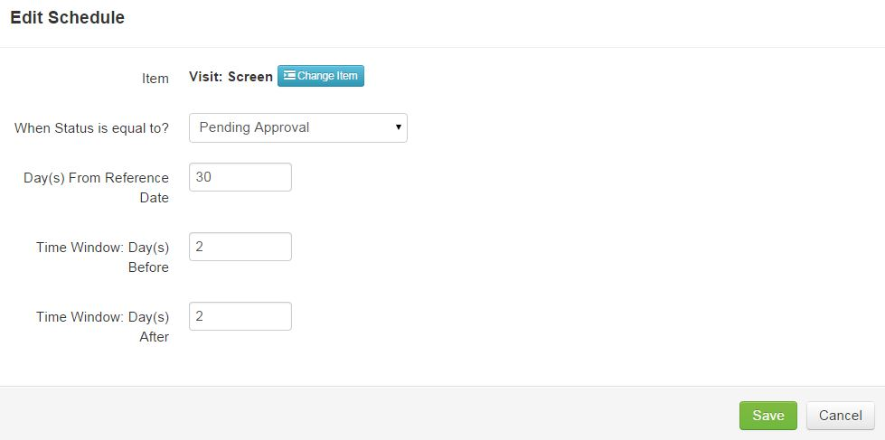
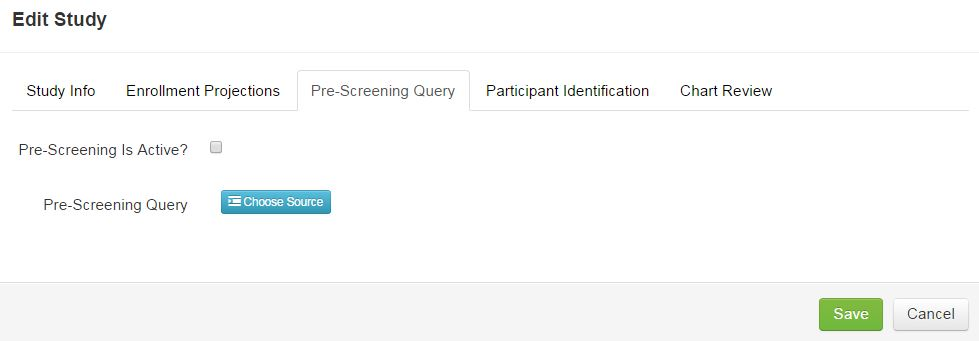

# Pending Items

Pending items are an easy way for a user to see items assigned to them. Pending items can include approvals, tasks, reminders, and alerts.

##Approval

If a user has the "Approver" role, they can receive pending items which allow for review and approval. Once a form is completed for a participant another user may submit the form for approval. This notification will let the approver know they can review that submitted form. If the approval is denied, a pending item will be assigned back to the person who submitted the form for approval. If approved, the reminder will be removed from the pending items list.

####How to Create an Approval Pending Item
1. On the participant's information screen, click the **Submit for Approval** button. An approval pending item will be created.

####How to View a Pending Approval Item
1. Double-click on the pending approval. The user will be re-directed to the participant's screen pending approval.
2. After data is reviewed, click **Approve** or **Deny**.

##Task
A task can be assigned to a user at the study level or at the participant level. A pending item notification will be created from that task.

####How to Create a Study Specific Task
1. Click **Work on Studies** > **Study Forms**.
2. Select study.
3. Click the **Tasks** tab.
4. Click **Create Task** button.
5. Enter information for task and click **Save**. The user the task was assigned to will receive a pending items notification.

####How to Create a Participant Specific Task
1. Click on **Work on Studies** > **Study Enrollment**.
2. Select study in filter.
3. Double-click on participant required.
4. Select form required.
5. Click the **Tasks** tab.
6. Click **Create Task** button.
7. Enter information for task and click **Save**. The user the task was assigned to will receive a pending items notification.

####How to View a Participant  or Study Specific Task
1. Open the task from the pending items screen to be re-directed to the study or participant specific task.
2. Click on the task tab.
3. Click on the task created to view details.
4. Task can be edited, re-assigned, or have the status changed.
5. Click **Save** to save edits.
6. Once a task is completed, the task will be removed from the tasks list but can be viewed later by clicking the **Show Completed** button.

##Schedule/Reminder

####How to Create a Schedule or Reminder
1. When defining a form, click the **Properties** button.
2. Click **Setup Schedule**.
3. Next to Item, click **Choose Item**.
4. Select question to set the trigger.
5. Enter numbers for the Day(s) from Reference Date, Time Window: Day(s) Before, and Time Window: Day(s) After.
6. Click **Save**.

Query will now run nightly and when participants are found from the query an alert pending item will be created.

####How to View a Reminder
1. Click **Pending Items**.
2. Double-click on selected reminder.
3. On the participant's form, select the schedule required on the right side of the screen. This will direct user to the section to which the reminder is referring.

##Pre-Screening Alert
An alert is created when a pre-screening query is created for a study. The query will run daily and will return a list of participants that may qualify for the study.

####How to Create a Pre-Screening  Alert
Creating an alert is done by creating a pre-screening query for a study.
1. Click **Author Studies** > **Define Studies**.
2. Select study.
3. Click **Properties**.
4. Click the **Pre-Screening Query** tab.
5. Check the "Pre-Screening Is Active?" checkbox.
6. Next to Pre-Screening Query, click **Choose Source**.
7. Select source from list and click **Save**.
8. Click **Save**.

####How to View a Pre-Screening Alert
1. Click on **Pending Items**.
2. Click on the participant
3. Click **Properties** to change the participant's status or click **Go To** to go into the participant's record. Filter can also be changed to show a different status for the participants. By default the filter is set to "Pre-Screen" but can be changed at any time.

