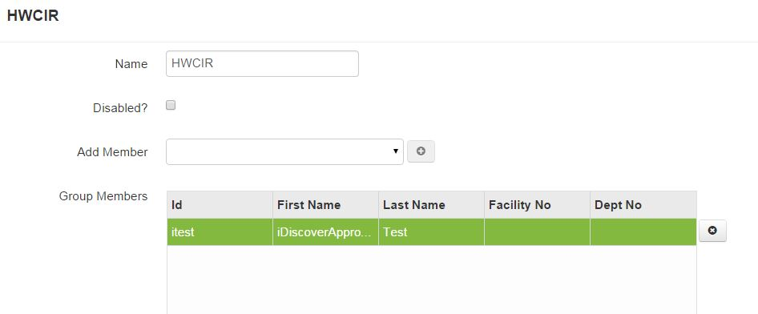

# Groups

A group can be created with one to many users for an organization and the group can have roles added to the group. This is a time saving tool if there will be several people within the same organization that have the same roles added.

####How to Create a Group
1. Click the user icon.
2. Click **Admin** and click **Groups**.
3. Click **Add**.
4. Add name of group and click **Save**.

####How to Add Users to a Group
1. Double-click the group.
2. Select users from the drop down list and click the **"Add"** icon.
3. Click **Save**.

