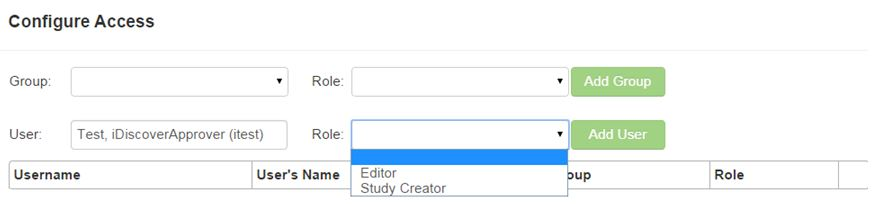

# Organizations
An organization is the highest level of security within ResearchDoc and can control who can create and edit studies for that organization.

####How to Create an Organization
1. Click the user permissions icon on the far right of the screen.
2. Hover over **Admin** and select **Organization**.
3. Click **Add**.
4. Enter the name and abbreviation for the organization.
5. Click **Save**.

####How to Add Users to an Organization
1. Click the user permissions icon on the far right of the screen.
2. Hover over **Admin** and select **Organization**.
3. Open an organization.
4. Click **Configure Access**.
5. Start typing the user's name and select the user's name from the drop down list. Select the role from the drop down list. Click **Save**.

NOTE: A group can be created with one to many users for an organization and the group can have roles added to the group. This is a time saving tool if there will be several people within the same organization that have the same roles added.

