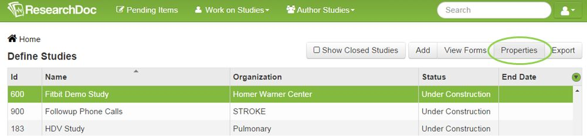
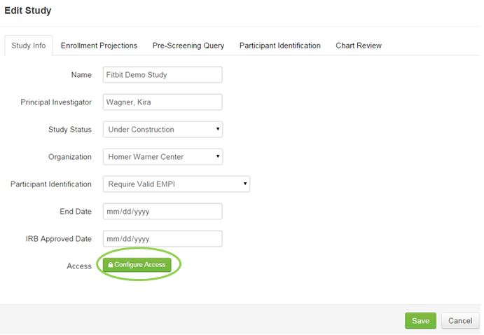
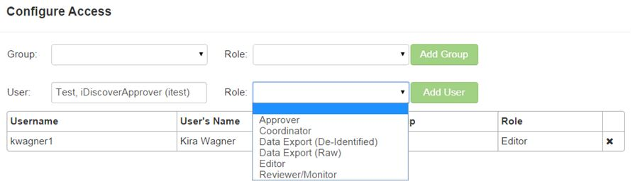

# Studies
At the study level, roles are assigned to users to grant them certain levels of access to the study.

####How to Add a User to a Study
1. Click **Author Studies**.
2. Select **Define Studies**.
3. Select study and click **Properties**.
4. Click **Configure Access**.
5. Enter users and select their roles from the drop down list.
6. Click Save.

NOTE: A group can be created with one to many users for an organization and the group can have roles added to the group. This is a time saving tool if there will be several people within the same organization that have the same roles added.
