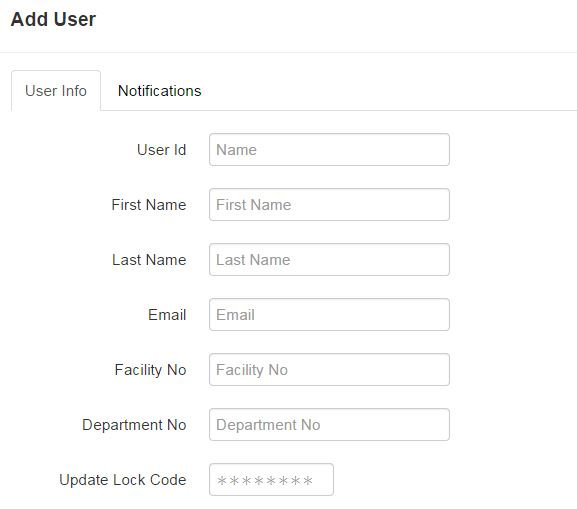
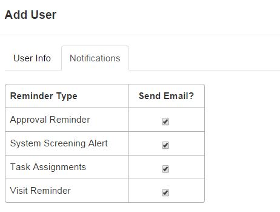

# Users
Users added to ResearchDoc must have an Intermountain LDAP username and password.

####How to Add a User

1. Select the user settings icon.
2. Select **Admin**, click **Users**.
3. Click **Add**.
4. Enter user ID, first name, last name and email address. Facility ID, and department number are optional.
5. Click **Save**.
6. To learn how to add a user to a study, refer to section 5.2 "Studies" in this documentation.

####How to Adjust User Settings
1. Click the user icon.
2. Select **User Settings**. Change desired settings. Here is where you can enter a lock code to unlock the iPad app from patient mode. On the Notifications tab, notification emails can be checked on and off to customize what notifications are sent via email.
3. Click **Save**.

