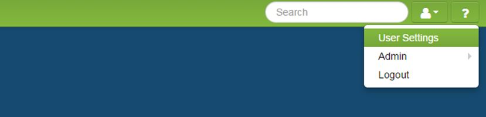

# User Settings
User Settings is provided so every user can configure their settings and notification preferences.

####How to Adjust User Settings
1. Click the user icon.
2. Select **User Settings**.
3. Manage settings. Here is where you can enter a lock code to unlock the iPad app from patient mode. On the Notifications tab, notification emails can be checked on and off to customize what notifications are sent via email.
5. Click **Save**.

