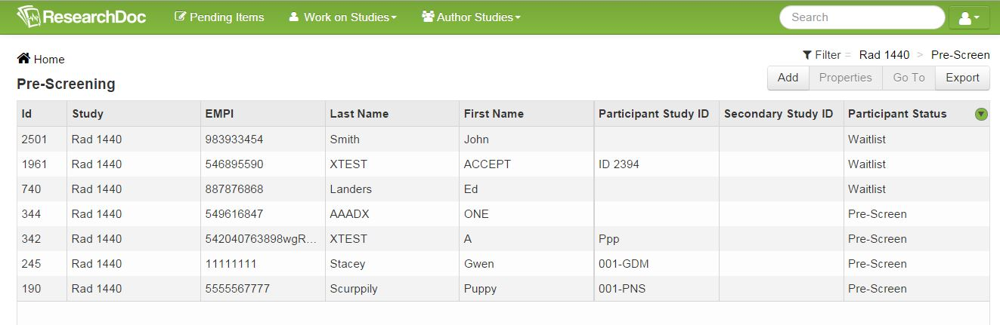
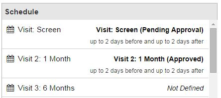

# Work on Studies

Work on Studies is where a user can select from options to enter data for their study. This includes:

#### Dashboard
High Level View of an Organization or a Study.

####Data Browser
View of Data for a Study

 

####Pre-Screening
List of All Results of a Pre-Screening Query

#### Schedule
List of All Scheduled Events

####Study Enrollment
List of All Participants Enrolled in a Study

####Study Forms
All Study Forms for an Organization

