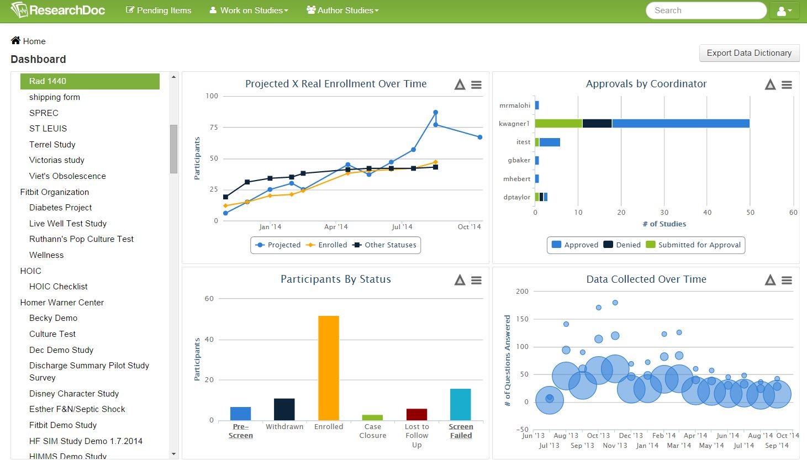

# Dashboard

The Dashboard is a reporting tool to see a high level view of an organization and a study. Graphs shown on organization and study levels can be made full screen, and can be exported into JPG, PNG, PDF, SVG, and CSV files.

At the organizational level, a bar graph will show all studies and how many participants enrolled in each study.

At the study level, four graphs will be shown.

####Projected Participants Over Time
Line graphs will show projections, enrollments, and other statuses. Each graph can be unchecked from view.

####Approval by Coordinator
A bar graph will show all users with access to the study and show the count of approved, denied, and submitted for approval data.

####Participants by Status
A column graph will show all statuses used in the study and how many participants are in each status.

####Data Collected Over Time
A bubble graph will show how many questions participants entered during a specific time point. A zoom feature allows the graph to be magnified. The zoom can also be reset.

