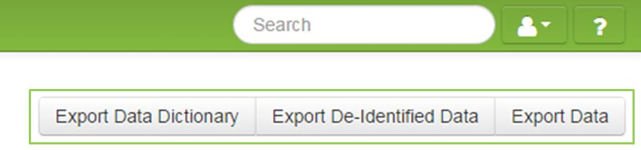

# Export Data
Data can be exported in a CSV file in Excel from the Dashboard screen. Three different files can be downloaded.

####How to Export Data Dictionary
Export Data Dictionary will export all the questions that have been created for the study but not data collected.

####How to Export De-Identified Data
Export De-Identified Data will export all data that is not deemed PHI. No participant information ex: name, date of birth EMPI etc. will be included. Participant Study ID will be included. No questions that were marked as PHI will be included in this export.

####How to Export Data
Export Data will export all the raw data for the study. Every question and all data collected. This will also include any fields that have been marked as PHI.

