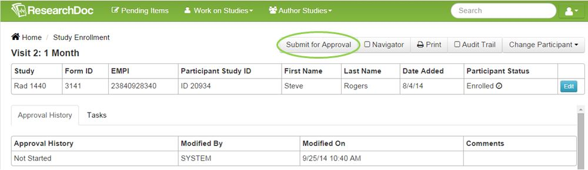
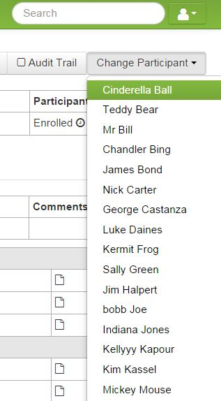

# Form Detail

Below the study level is the form level. Forms are created to contain questions. Forms can be thought of as a participant visit if applicable or can just be considered as a group of questions. A form can be submitted for approval if applicable for the workflow. This is an optional workflow.

####How to Submit a Form for Approval
1. On a participant's form, click **Submit for Approval**. This form will then be assigned to a user with the "Approver" role.

####How to View a Pending Approval Item
1. Double-click the pending approval and user will be re-directed to the participants screen pending approval. After data is reviewed, click **Approve** or **Deny**.

####How to Select a New Participant on the Participant Screen
1. Click **Work on Studies** > **Study Enrollment**.
2. Select a participant and select a form.
3. On the right of the screen, click **Change Participant**.
4. Select a participant from the dropdown box.

