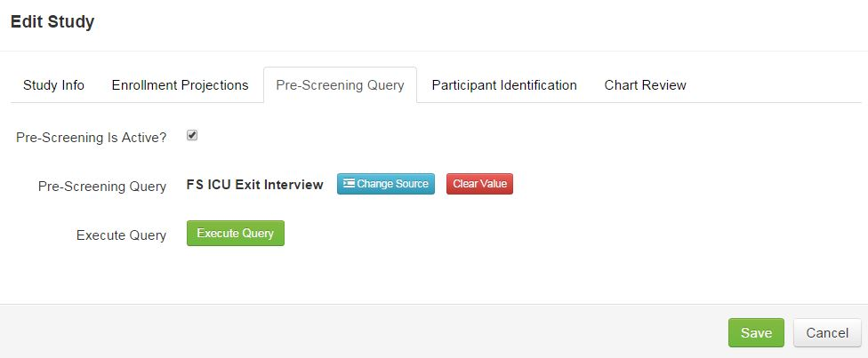
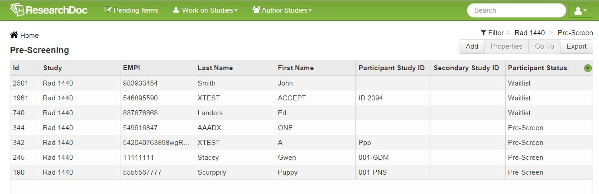

# Pre-Screening
The Pre-Screening section will display participants that have been pre-screened for a project from a SQL query that runs nightly and pulls in data from the Enterprise Data Warehouse (EDW). If someone in your department cannot write a SQL query, consult with the EDW team. The Homer Warner Center for Informatics Research team will then need to add the query to the query library before the query can be added to the study.

####How to Setup a Pre-Screening Query

1. Click **Author Studies** > **Define Studies**.
2. Select study.
3. Click **Properties**.
4. Click the **Pre-Screening Query** tab.
5. Check the "Pre-Screening Is Active?" checkbox.
6. Next to Pre-Screening Query, click **Choose Source**.
7. Select source from list and click **Save**.
8. Click **Save**.

Query will now run nightly and when participants are found from the query an alert pending item will be created.

####How to View a Pre-Screened Participant
1. Click **Pending Items**.
2. Click the participant name.
3. Click **Properties** to change the participant's status or click **Go To** to view the participant's record.
4. Change filter if desired. Filter can be changed to show a different status for the participants. By default, the filter is set to "Pre-Screen" but it can be changed at any time.

####How to View All Pre-Screened Participants
1. Click **Work on Studies>Pre-Screening**. Here all participants that have been pre-screened will appear.
2. Participants screened by the EDW query will be given a “System Screened” status.
3. Staff with the “Coordinator” role will get an email from ResearchDoc stating they have system screened participants waiting for their review.
4. Now that participants have been pre-screened their status can be changed to "Waitlist" "Enrolled" and several other options based on the appropriate workflow for the particiapnt.

