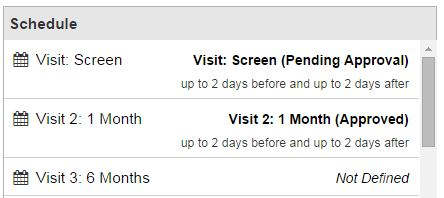

# Schedule

A schedule can be created as a reminder based on a trigger.

####How to Create a Schedule
1. When editing a study, select a form and click **Properties**.
2. Click **Setup Schedule**.
3. Next to Item, click **Choose Item**.
4. Select question to set the trigger. Possible options to select a trigger from include Form Level (Not Started, In Progress, Pending Approval, Approved, Denied), Sub Form Level (Marked as complete or incomplete), or Answer Types (Date and Date and Time, Days from reference date, and also days before and days after due date).
5. Click **Save**
6. The "Coordinator" role will receive an email notification when the schedule is triggered. Emails will be sent once a day during the defined time window while the trigger remains valid.

####How to View a Schedule from the Pending Items Screen
1. Click **Pending Items**.
2. Double-click the selected reminder.
3. On the participant's form, select the schedule required on the right side of the screen. This will direct user to the section to which the reminder is referring.

####How to View a Schedule from the Participant's Screen
1. Click **Work on Studies** > **Study Enrollment**.
2. Select a participant.
3. Open a form.
4. Click **Navigator**.
5. At the top of the navigator, there is the schedule section where all schedules can be viewed.
6. Click on a scheduled reminder to open that form.
7. Enter the required data in the form.

