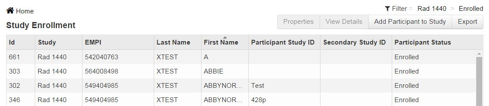

# Study Enrollment
Study Enrollment is a screen to view all participants in studies. Filters can select all studies and all various enrolment statuses for participants.

####How to Find a Study
1. Click **Work on Studies**.
2. Select **Study Enrollment**.
3. On the far right next to filter, click on the current underlined study shown.
4. Select the study required from the drop down list.

####How to Filter by Enrollment Status
1. Next to the study, click **Enrolled**. Enrolled is the default status.
2. From the drop down list, select required enrollments status.

####How to Add a Participant to a Study
1. Select study required following the steps above.
2. Click **Add Participant to Study**.

####How to View a Participant Already Created
1. Select study following steps above.
2. Double-click the participant from list or select participant and click **View Details**.

####How to Export Study Enrollment List
1. Select study following steps above.
2. Click **Export**.

