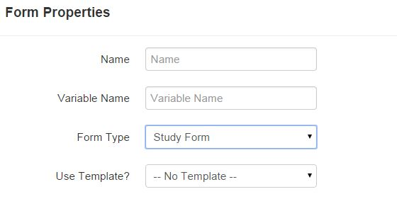
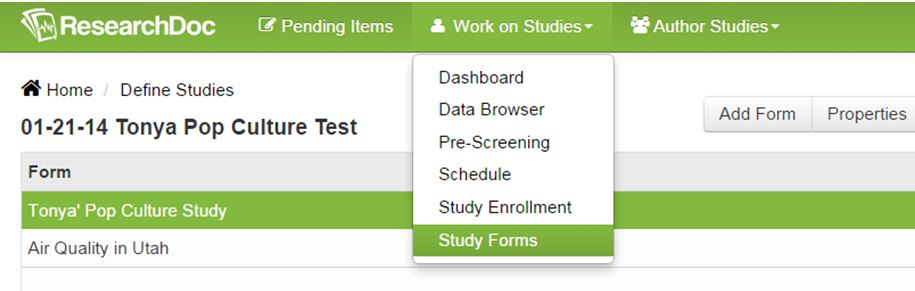

# Study Forms
Study forms are forms created specifically for a study, not for a participant. A study form is an ideal option if you want to collect data that is not directly related to a participant. Examples of study forms can be a drug log, a repository for all documentation used in the study, and a central location to document all communication between an IRB approval department or a collaborating department.

By design, a participant will never see a study form.

####How to Create a Study Form
1. Click on **Author Studies**.
2. Select study.
3. Click **Add Form**.
4. Enter form name and variable name if applicable.
5. Next to Form Type, select Study Form from the drop down list.
6. Click **Save**.
7. Enter questions for study form.

####How to View a Study Form and Enter Data
1. Click on **Work on Studies**.
2. Select **Study Forms**.
3. Select study and click **View Details** or double-click on a study form.
4. Data can now be entered for a study form.

