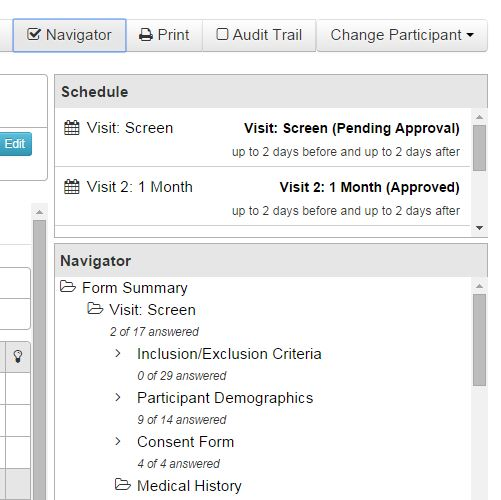

# Study Navigator

The Study Navigator is used to see a high-level overview of the entire study at the participant level.

####How to Open the Navigator
1. Click **Work on Studies** > **Study Enrollment**.
2. Select a participant.
3. Select a form.
4. On the right side of the screen, click **Navigator**. The navigator will be expanded on the right side of the screen showing all forms and sub forms for the participant.
6. Click a form or sub form to open.
7. To close the navigator, click the **Navigator** button again.

