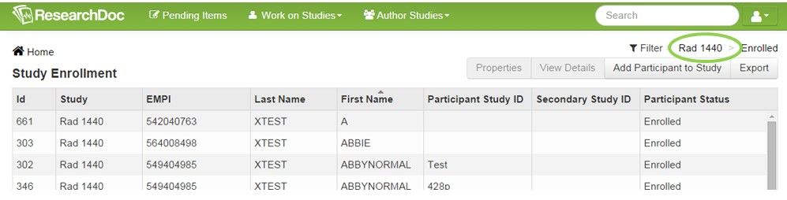
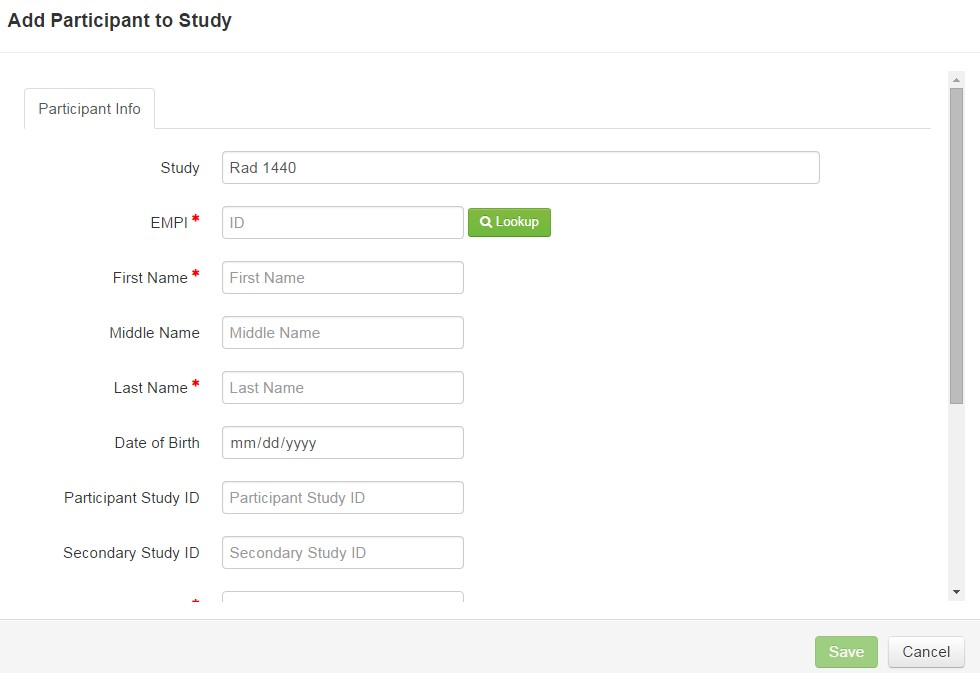
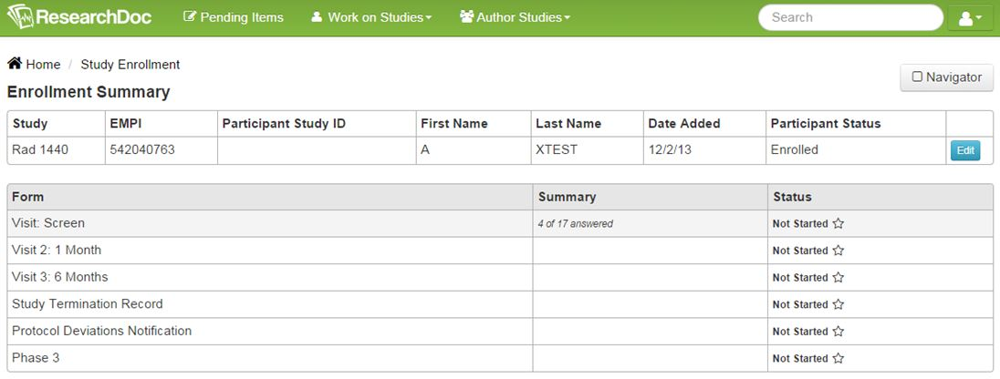
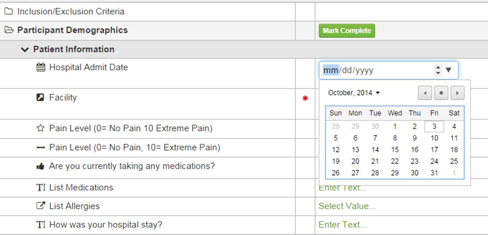

# Written Tutorials

####How to Enter Data in ResearchDoc
Click on Work on Studies.
Select Study Enrollment.

Select study from filter on far right of screen.

Click “Add Participant to Study.”
Enter participant information.

Click “Save.”
Double click on participant to enter data. Remember to double click on the ID number on the far left of the screen to put the most recently added participant to the top of the list.
Click once on form to open and enter data.

Enter data.

If applicable for workflow, submit form for approval when data entry complete.

